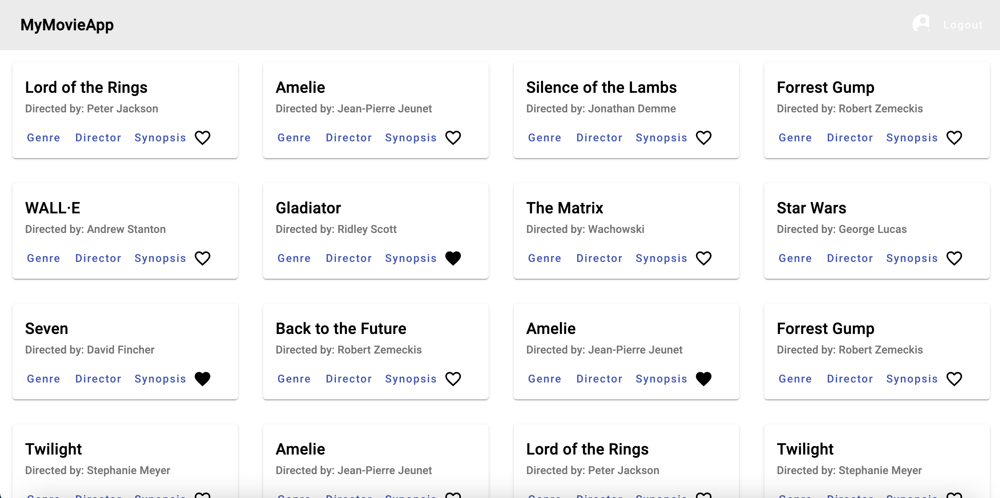
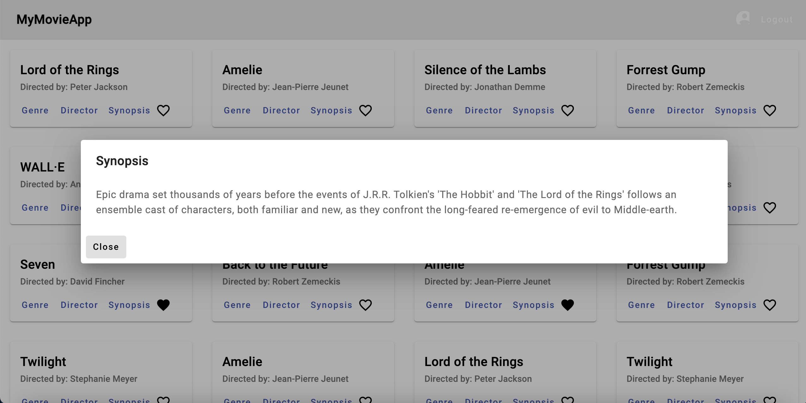
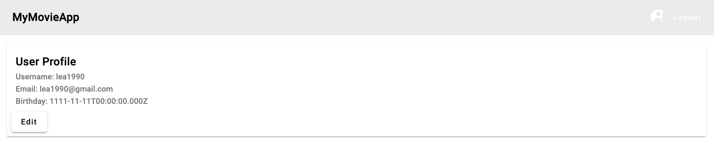

# MyFlixAngularClient

This is the fronend app for the movie-api build using Angular. This project was generated with [Angular CLI](https://github.com/angular/angular-cli) version 16.1.4.

## Demo App

You can test the app under this [url](https://leapapadopoulos.github.io/myFlix-Angular-client/)

## App Screenshots

## Development server

Run `npm install` to install dependencies.

Run `ng serve` for a dev server. Navigate to `http://localhost:4200/`. The application will automatically reload if you change any of the source files.

## Build

Run `ng build` to build the project. The build artifacts will be stored in the `dist/` directory.

## API Service

The `apiService` class is used for making API calls to the backend. It provides methods for user registration, user login, retrieving movies, retrieving user information, adding favorite movies, and more.

## Dependencies

The following dependencies are required to run the application:

- @angular/animations
- @angular/cdk
- @angular/common
- @angular/compiler
- @angular/core
- @angular/forms
- @angular/material
- @angular/platform-browser
- @angular/platform-browser-dynamic
- @angular/router
- rxjs
- tslib
- zone.js

## Development Dependencies

The following development dependencies are required for testing and building the application:

- @angular-devkit/build-angular
- @angular/cli
- @angular/compiler-cli
- @types/jasmine
- angular-cli-ghpages
- jasmine-core
- karma
- karma-chrome-launcher
- karma-coverage
- karma-jasmine
- karma-jasmine-html-reporter
- typedoc
- typescript

## Development

To contribute to the development of the application, follow these steps:

1. Fork the repository.
2. Create a new branch.
3. Make your changes and commit them.
4. Push your changes to your forked repository.
5. Submit a pull request.

## License

This project is licensed under the MIT License. See the [LICENSE](LICENSE) file for more details.
